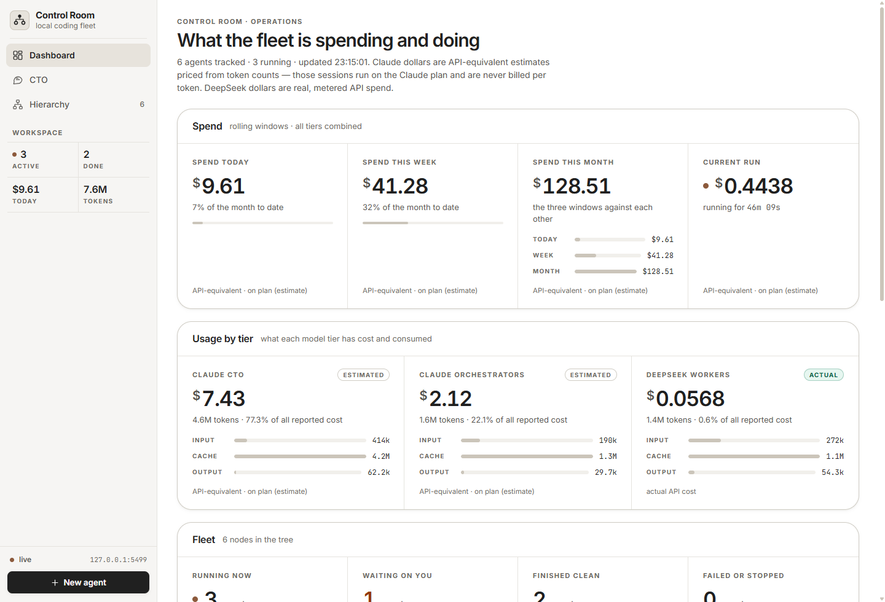
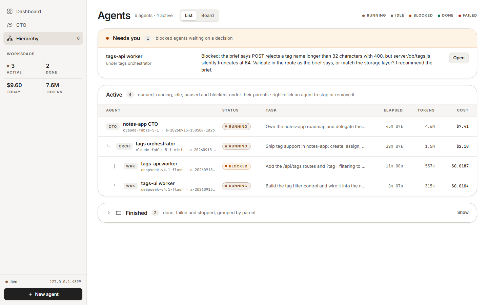
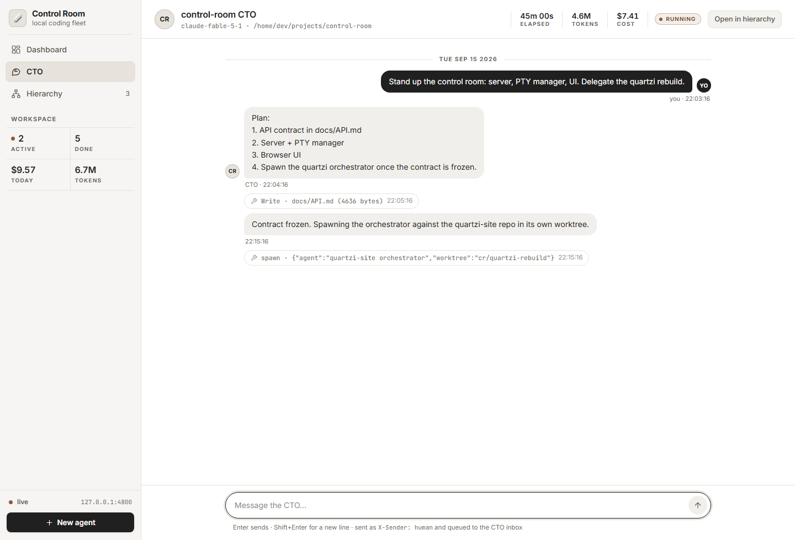

# Frontier + Worker Pipeline & UI

A local, desktop-only **app** - a control room for running a shallow hierarchy of
coding agents: a frontier-model *CTO* session spawns frontier *orchestrator*
sessions, which spawn cheap *worker* sessions. The CTO and orchestrators run on
either native runtime — **Claude Code** or **OpenAI Codex**, interchangeably —
and the worker tier is optional DeepSeek.

There is no fake chat layer. Every *managed* agent in the UI is a process you
could have started yourself in a terminal; the UI attaches to that terminal, so
you can read it, type into it, take control, interrupt it, or restart it. An
**external registration** is the one thing that is not: it tracks a session you
are already running, with no process and no terminal in the control room. Its
messages are queued to its inbox and only its transcript is read back.

---

## The problem this solves

Cheap models are good enough for bounded, well-specified work — a mechanical
refactor, a migration, a test suite, boilerplate — and cost a fraction of a
frontier model per token. They are *not* good at deciding what the work is,
splitting it up, or judging whether it is right.

So split the roles:

- **Frontier models plan and review.** They write the brief, choose the split,
  read every diff, run the proof command, and integrate.
- **Cheap workers execute.** One bounded task, one worktree, file-disjoint from
  their siblings, then they exit.
- **You watch.** All of it, live, in one place — and you can type into any
  managed agent's terminal at any moment, because it is a real terminal. An
  external registration is tracked only and has none.

The control room is the thing in the middle: it spawns the processes, keeps the
tree, streams the terminals to a browser, tracks tokens and cost, and gives
agents a tiny CLI (`bin/cr.js`) to spawn children, report upwards, and ask for
help when they are stuck.

---

## Architecture

```
                         you, in a browser at 127.0.0.1:4800
                                        |  HTTP + WebSocket
                        +---------------+---------------+
                        |      control room server      |   node:sqlite  ->  data/
                        |   HTTP API - /ws - static UI  |   transcript readers -> usage
                        +---------------+---------------+
                                        |  node-pty (ConPTY on Windows)
         +------------------------------+------------------------------+
         |                              |                              |
   +-----+-----+                  +-----+-----+                  +-----+-----+
   |    CTO    |                  | orchestr. |                  | orchestr. |   frontier CLI
   |  session  |                  |  session  |                  |  session  |   sessions
   +-----------+                  +-----+-----+                  +-----+-----+
                                        |                              |
                            +-----------+-----------+                  |
                        +---+---+   +---+---+   +---+---+          +---+---+
                        |worker |   |worker |   |worker |          |worker |   cheap CLI,
                        +-------+   +-------+   +-------+          +-------+   one-shot
                            |           |           |                  |
                        repo/.worktrees/<name>-<stamp>  on branch  cr/<name>-<stamp>
```

Each managed box is an operating-system process in its own pty; an externally
registered session is instead tracked by id, with no pty and no terminal input.
The server is the only thing that talks to the processes; the browser talks only
to the server.

**Ways up and down the tree.** A parent types into a child's terminal
(`cr send`). A child posts a short report to its parent's inbox (`cr report`)
and sets its own status (`cr status done|blocked|failed`). If you take control
of an agent in the UI, parent messages to it are queued to its inbox instead of
being typed in, so a human and an agent never fight over the same prompt. A
frontier session that is running out of provider quota can hand its role to a
successor on the other native runtime with `cr handoff` — see
[Native runtimes and handoff](#native-runtimes-and-handoff).

---

## Screenshots

**Dashboard** — what the fleet is doing and estimated cost from recorded tokens.
Worker and frontier dollar values use your price sheet, not billing records.
Subscription sessions are not billed per token. Read
[Cost tracking](#cost-tracking) before you quote either number.



**Hierarchy** — the agent tree as a board: what needs you, what is active, and a
collapsed folder of everything finished.



**Chat** — talk to any agent, with its tool calls inline and its children's
reports folded into the same thread.



---

## Quick start

**Prerequisites**

- **Node.js >= 22.13.** The server stores everything in the built-in
  `node:sqlite` module — no external database, no ORM — and `bin/cr.js` and the
  smoke test use global `fetch`. 22.13 is where `node:sqlite` stopped needing
  `--experimental-sqlite`, which is why `package.json` sets `engines.node` to
  `>=22.13.0`.
- **git** on your `PATH` (worktrees, diffs, file listings).
- **At least one native runtime CLI, installed and signed in.** The native
  CTO/orchestrator runtimes are Claude Code (`claude`) and OpenAI Codex
  (`codex`); either one is enough to start. Install and authenticate following
  the vendor's own documentation — [Claude Code docs](https://code.claude.com/docs/en)
  and [Codex CLI docs](https://developers.openai.com/codex/cli/) — rather than a
  command copied from here. Other agent CLIs are *setup assistants* at most; see
  [Set it up with your coding agent](#set-it-up-with-your-coding-agent).
- *(optional)* **DeepSeek Harness** for the cheap worker tier. It is not
  required: the shipped `config/runtimes.json` simply knows the worker runtime
  named `deepseek`. Without it the app still runs — you can drive the whole
  hierarchy on native `claude`/`codex` sessions, or point the `deepseek` runtime
  at whatever cheap CLI you use.

**Install and run**

```sh
git clone <this repo>
cd frontier-worker-pipeline-ui
npm ci          # reproducible install from package-lock.json
npm test        # offline checks; no CLI is spawned and no tokens are spent
npm start
```

Then confirm the server is actually up before trusting the browser — the health
body must carry `"ok":true`:

```sh
curl http://127.0.0.1:4800/api/health
# {"ok":true,"port":4800,...}
```

Then open <http://127.0.0.1:4800>.

A fresh database opens on a first-run page that explains the two ways in, and
every view has its own empty state rather than a blank panel. Either register
the session you are already sitting in (nothing is spawned; messages are queued
to its inbox and usage/chat are read from that CLI's own session file). Tell it
which native provider the session actually is, and give it the real session id
or an absolute transcript path — never invent one:

```sh
node bin/cr.js register --name "CTO" --role cto --provider claude \
  --session <session-id-or-absolute-transcript> --cwd /path/to/where/it-runs
```

…or have the control room start a native process for you:

```sh
node bin/cr.js spawn --name "CTO" --role cto --runtime codex \
  --cwd /path/to/repo --task "own the feature"
```

…or spawn an optional cheap worker:

```sh
node bin/cr.js spawn --name "docs pass" --role worker --runtime deepseek \
  --repo /path/to/repo --task "one line"
```

The **New agent** button does the same thing through the UI.

No agents, no keys, no CLIs installed yet? <http://127.0.0.1:4800/?mock=1> runs
the whole interface against an in-page fake server, and `?mock=1&empty=1` shows
the first-run states.

The other scripts in `package.json` are `npm run dev` (the same server under
`node --watch`) and `npm run cr -- <args>` (the agent-facing CLI).

`npm ci` fetches a prebuilt `node-pty` binary for your platform; macOS, Linux and
Windows are all supported. On Windows the pty layer uses ConPTY, so Windows 10
1809 or newer is required.

**First launch notes**

- Start the server from a plain terminal rather than from inside an agent
  session when you can. (The runtime adapters strip inherited agent-CLI
  environment markers either way, so nesting works, but a clean shell is
  simpler to reason about.)
- The first time an agent CLI runs in a folder it may show a trust prompt or a
  one-time feature prompt. Answer it yourself in that agent's **Terminal** tab.
  The control room deliberately does **not** auto-accept trust prompts.
- Nothing is spawned until you create an agent. `npm test` is the offline gate:
  it syntax-checks every shipped JavaScript file, refuses hard-coded home
  directories in the source, runs the pure UI modules in Node, then boots the
  server on a free port with a scratch data directory and a scratch
  `CR_CONFIG_DIR` and exercises the contract — the config expansion, the
  first-run responses, the validation refusals, an `external` agent's lifecycle,
  a working directory deleted underneath an agent, the usage delta arithmetic,
  deletion and re-parenting, and the WebSocket — without spawning any CLI or
  spending any tokens. It exits non-zero on the first broken assertion; that is
  the point of it. What it cannot prove is that a real Claude Code or Codex
  session works against your provider account — that is a live check only you
  can run.

---

## Set it up with your coding agent

The Quick start above is the manual path — the commands you run yourself. This
section is the same setup handed to an agent instead: find your tool below, run
it in the folder you want the clone to land in, and paste the block into it. The
prompt does the clone, the version check, the install, the launch, and then
explains what you are looking at and how to register that session as the CTO
node.

Native runtimes and setup assistants are different things. **Claude Code** and
**OpenAI Codex** are native runtimes: the control room can run a CTO or
orchestrator on either, and hand a role from one to the other. The other tools
below — Cursor, Gemini CLI, GitHub Copilot CLI and Cline — are **setup
assistants**: they can do the clone, install and start for you, but they are not
control-room runtime adapters. Aider is a third case: an edit-focused assistant,
not a general agent, so it gets the manual path.

Each block is self-contained. Run the one for your tool in the folder where you
want the clone to land. Install and authenticate that tool from its own vendor
documentation first — linked under each heading — rather than a command copied
from here.

**Claude Code (native runtime)** — install and sign in following the
[Claude Code docs](https://code.claude.com/docs/en), run `claude`, then paste:

```
Set up this local control room, then walk me through what it does. Read the repo's README and docs/API.md when you need specifics; do not invent commands or a session id.

1. Clone https://github.com/jakecodes431/frontier-worker-pipeline-ui into a sensible folder here. If a clone already exists, do not overwrite it — read its README and check `git status` first, then continue in place.
2. Check Node is 22.13 or newer and that git is on PATH. If Node is older, tell me how to upgrade on my OS and stop.
3. Install with `npm ci`, then run `npm test`. If either fails, read the real error and tell me what is missing rather than guessing.
4. Start the server with `npm start` in the background — it runs in the foreground. Wait for it, confirm `curl http://127.0.0.1:4800/api/health` returns a body with `"ok":true`, then open http://127.0.0.1:4800.
5. Explain what I am looking at: the Dashboard, the Hierarchy board, and an agent's Chat, Terminal, Diff and Files tabs. Managed agents are real CLI processes in real pseudo-terminals; an external registration is tracked only, with no terminal.
6. Register this session as the CTO node with `node bin/cr.js register --name "CTO" --role cto --provider claude --session <the real session id or absolute transcript path> --cwd <its folder>`. Find the real value on my machine; never make one up. Tell me what I can do with it once it is there.

This is a local, desktop-only app: it binds 127.0.0.1 with no authentication (do not expose the port), and it spawns real processes with my privileges. It ships no model access of its own — it drives the Claude Code and Codex CLIs already installed and signed in on my machine, billed to my own plan or API keys. Tell me plainly which steps you could not verify.
```

**OpenAI Codex (native runtime)** — install and sign in following the
[Codex CLI docs](https://developers.openai.com/codex/cli/), run `codex`, then
paste:

```
Set up this local control room, then walk me through what it does. Read the repo's README and docs/API.md when you need specifics; do not invent commands or a session id.

1. Clone https://github.com/jakecodes431/frontier-worker-pipeline-ui into a sensible folder here. If a clone already exists, do not overwrite it — read its README and check `git status` first, then continue in place.
2. Check Node is 22.13 or newer and that git is on PATH. If Node is older, tell me how to upgrade on my OS and stop.
3. Install with `npm ci`, then run `npm test`. If either fails, read the real error and tell me what is missing rather than guessing.
4. Start the server with `npm start` in the background — it runs in the foreground. Wait for it, confirm `curl http://127.0.0.1:4800/api/health` returns a body with `"ok":true`, then open http://127.0.0.1:4800.
5. Explain what I am looking at: the Dashboard, the Hierarchy board, and an agent's Chat, Terminal, Diff and Files tabs. Managed agents are real CLI processes in real pseudo-terminals; an external registration is tracked only, with no terminal.
6. Register this session as the CTO node with `node bin/cr.js register --name "CTO" --role cto --provider codex --session <the real session id or absolute transcript path> --cwd <its folder>`. Find the real value on my machine; never make one up. Tell me what I can do with it once it is there.

If you are running headless in a read-only sandbox, you cannot elevate it from inside this prompt: stop and tell me to restart with `codex exec --sandbox workspace-write`. Network access may still need separate approval.

This is a local, desktop-only app: it binds 127.0.0.1 with no authentication (do not expose the port), and it spawns real processes with my privileges. It ships no model access of its own — it drives the Claude Code and Codex CLIs already installed and signed in on my machine, billed to my own plan or API keys. Tell me plainly which steps you could not verify.
```

**Other tools (setup assistants): Cursor, Gemini CLI, GitHub Copilot CLI, Cline**
— install and sign in using each vendor's own docs:
[Cursor CLI](https://cursor.com/docs/cli/overview),
[Gemini CLI](https://github.com/google-gemini/gemini-cli),
[GitHub Copilot CLI](https://docs.github.com/en/copilot/how-tos/copilot-cli/set-up-copilot-cli/install-copilot-cli),
[Cline](https://docs.cline.bot/cli/cli-reference). Then run your tool and paste:

```
Set up this local control room, then walk me through what it does. You are a setup assistant here, not a control-room runtime. Read the repo's README and docs/API.md when you need specifics; do not invent commands or a session id.

1. Clone https://github.com/jakecodes431/frontier-worker-pipeline-ui into a sensible folder here. If a clone already exists, do not overwrite it — read its README and check `git status` first, then continue in place.
2. Check Node is 22.13 or newer and that git is on PATH. If Node is older, tell me how to upgrade on my OS and stop.
3. Install with `npm ci`, then run `npm test`. If either fails, read the real error and tell me what is missing rather than guessing.
4. Start the server with `npm start` in the background — it runs in the foreground. Wait for it, confirm `curl http://127.0.0.1:4800/api/health` returns a body with `"ok":true`, then open http://127.0.0.1:4800.
5. Explain what I am looking at: the Dashboard, the Hierarchy board, and an agent's Chat, Terminal, Diff and Files tabs. Managed agents are real CLI processes in real pseudo-terminals; an external registration is tracked only, with no terminal.
6. Ask which native CTO runtime I want: Claude Code or Codex. Start that managed CTO through New agent or the documented cr spawn command. Do not register this setup-assistant session: it is not a supported transcript provider. If neither native CLI is installed and signed in, explain what is missing.

This is a local, desktop-only app: it binds 127.0.0.1 with no authentication (do not expose the port), and it spawns real processes with my privileges. It ships no model access of its own — it drives the Claude Code and Codex CLIs already installed and signed in on my machine, billed to my own plan or API keys. Tell me plainly which steps you could not verify.
```

**Aider — manual path.** Aider is an edit-focused pair-programming assistant,
not a general-purpose agent: cloning, installing, starting a long-lived server
and opening a browser are outside what it does. Use the
[Quick start](#quick-start) by hand. See the [Aider docs](https://aider.chat/docs/).

**Two things no prompt can do for you.**

- **Permissions.** The agent needs whatever permission mode lets it run `git`,
  `npm` and a long-lived server; most tools ask once. A Codex prompt in
  particular cannot change the sandbox it is already running inside. For
  headless `codex exec`, start it with `--sandbox workspace-write` so the
  workspace is writable — the current local `codex exec --help` lists
  `workspace-write`, and a read-only run cannot clone, install or start the
  server. Network access may still need separate approval. See the
  [non-interactive mode docs](https://learn.chatgpt.com/docs/non-interactive-mode).
- **The foreground server.** `npm start` does not return, so an agent that waits
  for the command to exit will sit there; tell it to background the server, or
  start it yourself in a second terminal.

---

## Configuration

Everything lives in `config/` — `runtimes.json` (how to start each CLI),
`pricing.json` (what tokens cost) and `protocol.md` (what every agent is told
first) — plus environment variables. No config file contains a secret, and none
contains a machine-specific path: string values in `runtimes.json` support
`${VAR}` and `${VAR:-fallback}` expansion from the environment, and a leading
`~` expands to your home directory. If a variable is undefined and has no
built-in default, the server prints a warning naming it at startup.

Built-in fallbacks, so the defaults work on a fresh machine:

| Variable | Default | What it points at |
|---|---|---|
| `DSH_REPO` | `~/deepseek-harness` | Your DeepSeek Harness clone (the worker CLI). |
| `DSH_HOME` | `~/.dsh` | DeepSeek Harness state — sessions are read from here for usage. |
| `CLAUDE_CONFIG_DIR` | `~/.claude` | Claude Code state; transcripts live under `projects/`. |
| `CODEX_HOME` | `~/.codex` | Codex state; rollouts live under `sessions/`. |

Set these in your shell, or keep them in a `.env` (see `.env.example`) and start
the server with Node's built-in loader:

```sh
node --env-file=.env server/index.js
```

Prefer to keep your edits out of the checkout entirely? Point `CR_CONFIG_DIR`
at a directory holding your own `runtimes.json` / `pricing.json` /
`protocol.md`; any file missing there falls back to the one in `config/`.

### `config/runtimes.json`

The only place CLI invocation lives. Top level:

| Key | Meaning |
|---|---|
| `port`, `host` | Listen address. Default `127.0.0.1:4800`. |
| `dataDir` | Where SQLite, scrollback and staged briefs go. Default `./data`. |
| `briefArgvLimit` | Briefs longer than this are written to a file and the agent is told to read it, instead of being passed as one enormous argv. |
| `worktreeDir`, `worktreeBranchPrefix` | Worktree layout; default `.worktrees` and `cr/`. |
| `runtimes` | One entry per runtime (see below). |

Each runtime entry:

| Key | Meaning |
|---|---|
| `label` | Shown in the UI. |
| `command`, `args` | How to start it. Per-agent placeholders `{model}`, `{effort}`, `{permissionMode}`, `{sessionId}`, `{name}`, `{prompt}` are substituted at spawn time; an argument that resolves to empty is dropped along with the option flag in front of it, so an unset value falls back to the CLI's own default instead of leaving a dangling flag. (`${VAR}` is different — that is environment expansion, done once at load.) |
| `resumeArgs` | Optional. Used by **Restart** when the session can be resumed by id. |
| `defaults` | `model`, `effort`, `permissionMode` when the caller does not pass them. |
| `env` | Extra environment for this runtime (a leading `~` is expanded). |
| `scrubEnvContaining`, `keepEnv` | Credential hygiene, opt-in per runtime: delete inherited variables whose *name* contains any of these substrings (e.g. `KEY`, `TOKEN`, `SECRET`) except the ones explicitly kept. Only runtimes that set these keys apply them — in the default config, the `deepseek` worker; a runtime that does not set them passes the environment through. The control room never reads the values it keeps — it only passes them through. |
| `transcriptRoot` / `sessionStore` | Where that CLI writes its session transcripts, so usage and chat can be read back. |
| `idleAfterSilenceMs` | How long a silent-but-finished session waits before it is shown as `idle` rather than `running`. |
| `oneShot` | True for workers that run one task and exit. |

The runtime names the control room understands:

- **`claude`** — a native interactive Claude Code session. Usage and chat are
  read from the CLI's own JSONL transcript under `transcriptRoot`.
- **`codex`** — a native interactive OpenAI Codex session, interchangeable with
  `claude` for the CTO and orchestrator tiers. See the
  [Codex CLI docs](https://developers.openai.com/codex/cli/).
- **`deepseek`** — an optional headless DeepSeek Harness worker, one task then
  exit. It resolves to `${DSH_REPO}/apps/cli/lib/bin.js`, so set `DSH_REPO` (or
  edit the config) to point at your own install. Usage comes from the harness
  session store under `${DSH_HOME}`. Nothing in the server depends on this
  runtime existing, and you can replace the whole entry with any other CLI that
  takes the prompt as its last argument.
- **`external`** — a session the control room did *not* spawn (for example a CTO
  you are running yourself in a desktop app). It appears in the tree and its
  usage is tracked by session id; messages to it are queued in its inbox rather
  than typed into a terminal. An external agent carries a `transcriptRuntime`
  (`claude` or `codex`) saying which CLI's transcript reader to use.

Adding another runtime is a config entry plus a small adapter — see
[CONTRIBUTING.md](CONTRIBUTING.md).

### Environment variables

| Variable | Used by | Meaning |
|---|---|---|
| `CR_PORT` | server | Overrides `port` from the config file. |
| `CR_DATA_DIR` | server | Overrides `dataDir`. Useful for a scratch run. |
| `CR_CONFIG_DIR` | server | Directory to read config files from before falling back to `config/`. |
| `DSH_REPO`, `DSH_HOME`, `CLAUDE_CONFIG_DIR` | config expansion | See the table above. |
| `CR_URL` | `bin/cr.js` | Control room base URL. Default `http://127.0.0.1:4800`. Set automatically in every spawned agent. |
| `CR_AGENT_ID` | `bin/cr.js` | The calling agent's own id. Set automatically in every spawned agent; you do not set it by hand. |
| `CR_BIN` | agents | Absolute path to `bin/cr.js`, injected so briefs can reference it. |
| `CR_PARENT_ID` | agents | The agent's parent id, or empty for a top-level agent. |
| provider keys | the agent CLIs | e.g. an API key for your worker CLI. These belong to that CLI, not to the control room — set them in your shell or in the runtime's `env`. |

`.gitignore` already covers `.env` (and `.env.*`, except `.env.example`), plus
`data/`, `node_modules/`, `.worktrees/` and `config/*.local.json`.

### Codex runtime behavior

The adapter starts the interactive `codex` CLI in a PTY with `--no-alt-screen`.
It leaves model and reasoning effort to your CLI configuration unless you
choose overrides. `permissionMode` selects the CLI sandbox: `read-only`,
`workspace-write` (the shipped default), or `danger-full-access`. It does not
bypass approval prompts.

New session IDs are discovered from `CODEX_HOME/sessions` using the working
directory, launch time and the agent ID in its brief. Ambiguous matches are
refused. Restart uses `codex resume` with that saved UUID, never `--last`, so
parallel sessions cannot silently resume one another.

### `config/pricing.json`

USD per million tokens, per model, plus aliases and a `tier` label used by the
dashboard. **Edit this to match the price sheet you actually pay.** Every row
carries an `estimated` flag; see [Cost tracking](#cost-tracking) for what that
means.

### `config/protocol.md`

The text prepended to every spawned agent's brief: how to use `cr`, the rules
about worktrees and reviews, and when to mark itself blocked. Edit it to change
how your agents behave.

---

## How agents talk to the control room

Every spawned terminal gets `CR_AGENT_ID`, `CR_URL`, `CR_BIN` and
`CR_PARENT_ID` in its environment, and `config/protocol.md` at the top of its
brief. The agent-facing CLI is a single dependency-free file, `bin/cr.js`:

```sh
# spawn a native CTO or orchestrator (claude or codex)
node bin/cr.js spawn --name "CTO" --role cto --runtime codex \
  --cwd /path/to/repo --task "own the feature"

# spawn a child in a fresh worktree of a repo and wait for it
node bin/cr.js spawn --name "migrate-config" --role worker --runtime deepseek \
  --repo /path/to/repo --task "one line" --brief-file brief.md --wait

node bin/cr.js register --name "CTO" --role cto --provider claude \
  --session <session-id-or-absolute-transcript> --cwd /path/to/repo
                                    # track a session nothing spawned (no process starts)

node bin/cr.js handoff <id> --runtime codex  # move this role to a new native successor
                                    # (stop the source first: it must have no live terminal)

node bin/cr.js list                 # your children: status, tokens, cost
node bin/cr.js tree                 # the whole hierarchy
node bin/cr.js wait <id...>         # block until they reach a terminal status
node bin/cr.js result <id>          # a child's final answer
node bin/cr.js logs <id> --tail 4000
node bin/cr.js send <id> "text"     # type into a child's real CLI
node bin/cr.js report "text"        # short report to your parent's inbox
node bin/cr.js inbox                # reports your children sent you
node bin/cr.js status blocked --note "the exact question"
node bin/cr.js stop <id> | restart <id> | agent <id> | usage | health
node bin/cr.js help                 # the same list, from the running CLI
```

Every command is a thin wrapper over the HTTP API in
[docs/API.md](docs/API.md), so anything an agent can do you can do with `curl`.

Rules the server enforces rather than trusts:

- `send` from a parent is refused with `409` while a **human** holds control of
  the target — and only in that case is the text queued to the target's inbox
  instead. A `send` to a paused agent is refused with `409` and dropped; so is
  one to an interactive agent with no live terminal. (A `send` to an `external`
  agent is always queued to its inbox, since there is no terminal to type into.
  A `send` to a one-shot local worker is queued durably and then dispatched to a
  fresh run of that worker whose prompt carries the queued messages — never into
  stdin. It is acknowledged only once that run starts, so a refused or failed
  dispatch stays in the inbox and is retried on the next send, restart, or exit.)
- `status` only accepts `done`, `blocked`, `failed`, `running`, `idle`. A child
  marking itself `blocked` automatically posts `BLOCKED: <note>` to its
  parent's inbox.
- `handoff` refuses with `409` while the source agent still has a live terminal.
  Stop it first (`cr stop <id>`); the successor starts in the same cwd/worktree
  with the same role and parent.

---

## Native runtimes and handoff

The CTO and orchestrator tiers are served by two interchangeable native
runtimes: **Claude Code** (`claude`) and **OpenAI Codex** (`codex`). A native
session is a real CLI process in a real pty; the control room drives it, reads
its transcript and streams its terminal. The optional worker tier is DeepSeek.
`external` is not a native runtime at all — it is tracking.

### Registering a session you are already in

```sh
node bin/cr.js register --name "CTO" --role cto --provider codex \
  --session ID_OR_ABSOLUTE_TRANSCRIPT --cwd /path/to/repo
```

- Registration creates an **external, tracked** agent. No process and no pty are
  created, and there is no terminal input: chat sends are queued to its inbox
  and only its transcript is read back.
- `--provider codex|claude` selects which CLI's transcript reader to use and is
  stored as the agent's `transcriptRuntime`. Choose the provider that the session
  actually is.
- `--session` takes the real session id **or** an absolute path to a transcript
  file. Never invent one; the value has to be something the provider really
  wrote.

### Spawning a native CTO or orchestrator

```sh
node bin/cr.js spawn --name "CTO" --role cto --runtime codex \
  --cwd /path/to/repo --task "own the feature"

node bin/cr.js spawn --name "tags" --role orchestrator --runtime claude \
  --parent CTO_ID --repo /path/to/repo \
  --task "Ship tag support" --brief-file ./tags-orchestrator.md
```

### Handing a role to the other runtime

```sh
node bin/cr.js handoff ID --runtime codex [--model M] [--effort E] \
  [--no-start] [--brief-file FILE]
```

`handoff` is the manual way to continue a frontier role when a provider limit is
close or the subscription is exhausted. It is **not** an automatic switch and it
does **not** bypass anyone's quota.

- The source must have **no live terminal**. `cr stop ID` first; the API refuses
  with `409` otherwise.
- The successor starts in the **same cwd/worktree**, with the same **role** and
  **parent**. The source's children and report routing are re-parented to the
  successor, and the old agent stays in the tree with its history retained.
- The successor's context is built from the **recovered task, brief and
  reports** — not from the vendor's native conversation, and **not** by
  transferring quota or session state between providers. Expect a fresh CLI
  conversation that has read the same brief and report log.
- `--no-start` creates the successor record without launching it.
- The source gets `successorId`; the successor gets `continuedFromId` and
  `transcriptRuntime`.

The HTTP equivalent is `POST /api/agents/:id/handoff` with
`{ runtime, model?, effort?, autoStart?, brief? }`, returning `201` and the
successor Agent. Full field list in [docs/API.md](docs/API.md).

### Shutdown, state and recovery

- On a **graceful** shutdown the server stops the managed processes it started.
- On a **hard crash** (power loss, `SIGKILL`) terminal attachment is lost. There
  is no auto-reattach: on the next start those agents need an explicit **stop**
  or **restart**.
- Agent state and history persist in SQLite, so the tree, reports and usage
  survive either way.

### What the numbers mean for native frontier sessions

Codex and Claude are frontier tiers. Unless a transcript carries real provider
billing data, their dollar figures (and the savings figure derived from them) are
API-equivalent **estimates** priced from your hand-maintained
`config/pricing.json` — not an invoice, and not proof of what a plan charged you.
Provider **quota is unknown** unless the transcript itself carries real usage
data; the control room does not query a billing or quota API. A model missing
from the price sheet is **unpriced, not free** — read its `$0.00` as "no row".

---

## The worktree model

Passing `--repo <path>` to `spawn` creates an isolated git worktree:

```
<repo>/.worktrees/<name>-<stamp>      on branch  cr/<name>-<stamp>
```

That directory becomes the agent's working directory. Consequences worth
knowing:

- A worktree is created from a **committed** base (the branch or ref you name),
  so uncommitted changes in your checkout are simply not copied and do not appear
  in the agent's folder. A dirty checkout does **not** prevent `git worktree
  add`; it just means the work in progress is not part of the agent's starting
  point. Commit the base you want the agent to build on.
- Workers never share a checkout, so two workers cannot collide in one file —
  provided their briefs are file-disjoint, which is the parent's job.
- A worktree isolates **changed paths**, not processes. It is **not** a security
  sandbox: an agent still runs with your privileges and can write outside its
  worktree unless the underlying CLI's own permission mode stops it.
- The **Diff** and **Files** tabs run `git diff` / `git status` in that
  worktree, so you can read exactly what a worker changed before anything is
  integrated.
- Integration is deliberately a *frontier* job: orchestrators merge their
  workers' branches one at a time, running the proof command after each; the
  CTO merges the orchestrators.
- Worktrees are **not** deleted when you remove an agent from the tree. Clean
  them up with `git worktree remove` when you are done with them.

---

## Cost tracking

The dashboard shows spend today / this week / this month, the cost of the
current run, usage broken down by tier, fleet counts, token totals, and the
saving from delegating to cheap workers.

**Read this before you quote any of those numbers.**

- Token counts come from local CLI transcripts. Cost figures for both workers
  and frontier sessions multiply those counts by your configured price sheet;
  they are estimates, not invoices or authoritative provider billing.
- Subscription sessions are not billed per token. Frontier estimates show an
  API equivalent for comparison; savings also remain estimates.
- An unknown model is unpriced. Its tokens still count, but a numeric zero in
  an aggregate does not establish that its use was free. The API exposes
  `pricingKnown` and `unpricedModels` so callers can show that distinction.
- Some ids are deliberately never priced because they are not models: Claude
  Code stamps `<synthetic>` on assistant entries that are API error notices.
  Those are listed separately under `unpricedMarkers` (with their own `reason`)
  and never make `pricingComplete` false. Add your own under `markers` in
  `config/pricing.json` if another CLI has an equivalent placeholder.
- Codex has no default price row. Add a verified model rate to
  `config/pricing.json` if you want a dollar estimate. Its undocumented
  `gpt-reserve` fallback ("Luna Reserve") ships with an explicitly inferred
  GPT-5.6 Luna-class estimate you should verify before trusting.
- Codex rollout `rate_limits` may provide an account-level observation of
  usage windows. Missing data is unknown, and even present data may be stale;
  it is not this agent's private allowance. Claude and DeepSeek quota remain
  unknown. Use the provider for authoritative limits and billing.

---

## Daily budget, usage connection and imports

**Daily budget.** `GET /api/budget` shows the day's measured DeepSeek spend
beside a daily-USD cap you set with `POST /api/budget {"dailyUsd": 10}` (`null`
clears it), persisted to `data/budget.json` (`CR_DATA_DIR` moves it). It is a
**tracking aid, not enforcement**: passing the number never pauses or refuses an
agent, it only lets the dashboard show "$4.10 of $10.00 today (41%, $5.90
left)". The accepted value is a finite number greater than 0 and at most
1,000,000; anything else is a `400`.

**Connecting a Claude session to hub usage.** Managed Claude sessions are
started with a `statusLine` command that runs this checkout's
`scripts/claude-statusline.mjs` against the server's data directory, so their
plan usage reaches the hub without reading any credential. For a Claude session
the hub did not start, call `GET /api/claude-usage` and add the returned
`settings.statusLine` to your Claude Code settings, preserving everything else;
usage appears after the next API response on a supported plan. The script keeps
only the five-hour/seven-day percentages and reset times. Make sure the session
and the server use the same `CR_DATA_DIR` (default `./data`) or the hub will
never see the file. `CR_PORT` changes where the hub listens and `CR_CONFIG_DIR`
changes where `runtimes.json` / `pricing.json` / `protocol.md` are read; neither
moves the usage file.

**Importing a previous control room's history.** `node scripts/import-history.mjs
<source-data-dir> <destination-data-dir>` additively merges a previous data
directory — its `control-room.sqlite` tables (agents, messages, events, usage
samples and cursors) plus `scrollback/` and `briefs/` files — into an
already-initialized destination. It backs the destination up to
`before-history-import-<timestamp>.sqlite` first, never overwrites a row or file
already in the destination, records what it imported so a repeated run is a
no-op, forces any agent that was mid-run to `stopped` (a persisted flag is not a
live process), and prints the imported counts and backup path. Both directories
must exist and differ, and the destination must already contain
`control-room.sqlite`.

**Folder picker.** `POST /api/directories/pick` (`{ "initialPath": "…" }`,
optional) opens the OS folder chooser for the New-agent form — and only ever
because the operator clicked the button; nothing opens a dialog on its own. It
is Windows-only and answers `501` elsewhere. It returns `200 { "path": "…" }`
with the chosen absolute directory, `200 { "path": null }` on cancel (not an
error), `409` when a picker is already open, `504` on timeout, and `400` when
`initialPath` is present but not a string. An unusable *string* `initialPath`
(relative, stale or not a directory) is ignored and the dialog opens at its
default, so a stale value in the form cannot block picking. Full contract in
[docs/API.md](docs/API.md#post-apidirectoriespick).

---

## Security and limits

This is a single-user local developer tool. Loopback binding and same-origin
HTTP/WebSocket checks reduce browser exposure; they do not authenticate users.

- **It binds `127.0.0.1` and has no authentication, no accounts and no
  authorization.** Anyone who can reach the port can spawn processes.
- **Do not expose it.** Non-loopback binding is refused. Do not publish
  it through a reverse proxy, port forward or tunnel.
- **Managed agents are real processes** with your user's privileges, in
  directories you name, and they inherit your environment — minus the agent-CLI
  markers the adapters always strip, and minus the credential-looking variables
  for a runtime that opts into scrubbing (in the default config, the `deepseek`
  worker). They can write files and run commands. An **external registration is
  not a process**: it is a record plus a transcript read, with no pty and no
  terminal input. Give managed agents worktrees, not your home directory.
- **It reads CLI transcripts on your machine** to compute usage — the JSONL and
  JSON session files those CLIs already write under your home directory. Those
  files contain your prompts and the models' replies. The control room reads
  them locally and sends them nowhere.
- **Briefs are written to disk** under `data/briefs/`, and terminal scrollback
  under `data/scrollback/`. Treat `data/` as sensitive; it is gitignored.
- There is **no process sandbox**. Permission modes are whatever the underlying
  agent CLI supports, passed straight through from the config, and a git worktree
  isolates changed paths, not processes — it is not a security boundary.
- The control room does not handle provider credentials and never reads the
  values of the variables it passes on. Where a runtime asks for it
  (`scrubEnvContaining` / `keepEnv`), it deletes credential-looking variables
  from that runtime's environment before spawning; a runtime that does not ask
  inherits them.

---

## Project layout

```
server/            HTTP + WebSocket server, PTY manager, SQLite, git helpers
  index.js         routes, spawn/act/status, usage summary, WS fan-out
  config.js        config + pricing loading, price maths
  db.js            node:sqlite schema and accessors
  pty.js           node-pty process manager and scrollback
  git.js           worktrees, diff, file listing, process-tree kill
  usage.js         transcript readers (per CLI) -> token buckets
  adapters/index.js  one adapter per runtime (claude, codex, deepseek,
                   external): build argv/env, stage briefs, read usage + chat
bin/cr.js          the agent-facing CLI (no dependencies)
ui/                browser UI: vanilla ES modules, no build step
  views/           dashboard, hierarchy, agent panel, new-agent form, CTO chat
  views/tabs/      chat, terminal (xterm.js), diff, files, logs
  lib/             api, ws, store, dom, formatting
  mock.js          in-page fake server for UI work (`?mock=1`)
config/            runtimes.json, pricing.json, protocol.md
scripts/smoke.mjs  offline API smoke test (run by `npm test`)
scripts/launch-orchestrator.mjs  spawn an orchestrator through the running
                   server's API (`--help` for options)
briefs/            what a brief is, plus example orchestrator/worker briefs
examples/          a worked end-to-end run (one orchestrator, three workers)
docs/API.md        the HTTP + WebSocket contract
docs/TROUBLESHOOTING.md  the real failure modes and what to do about them
docs/screenshots/  the images used in this README
.claude/           agent skills and an agent definition shipped with the repo;
                   third-party skills are credited in NOTICE and keep their own
                   LICENSE files
data/              SQLite, scrollback, staged briefs (gitignored)
```

---

## Roadmap and limitations

An honest list of what is unfinished or deliberately absent:

- **No authentication or multi-user support**, and none planned. This is a
  single-user local tool.
- **Quota visibility depends on provider evidence.** Codex may expose the latest
  account-level rate-limit observation from its rollout; absent data is unknown.
  Claude and DeepSeek quota are not queried.
- **Native adapters for Claude Code and Codex**, an optional DeepSeek worker
  adapter, and `external` tracking. Other CLIs need a small adapter, mostly to
  parse their transcript format.
- **Pause is cooperative.** There is no `SIGSTOP` on Windows, so pause
  interrupts the current turn and makes the server refuse parent input until you
  resume; it does not freeze the process.
- **Graceful shutdown stops managed processes; a hard crash does not.** On a
  clean exit the server stops the processes it started. After a crash (power
  loss, `SIGKILL`) terminal attachment is lost and there is **no auto-reattach**:
  those agents need an explicit stop or restart. State and history persist in
  SQLite either way, and a runtime that supports resume-by-id picks up where it
  left off while one-shot workers re-run from scratch.
- **Worktrees are never cleaned up automatically** (see above).
- **Frontier cost figures are estimates** against a hand-maintained price sheet,
  and provider quota is unknown (see [Cost tracking](#cost-tracking)).
- **Offline checks are not live provider proof.** `npm test` runs the repository's
  configured checks against local code and scratch state. It cannot establish
  that your provider login, selected model, plan or current quota works.
- **The UI ships an in-page mock server** (`ui/mock.js`, enabled with `?mock=1`)
  for working on the interface without spawning anything. It is developer
  scaffolding kept in step by hand, not a guaranteed-faithful demo mode.
- **Chat tabs render a CLI's own transcript**, merged with the control room's
  message log; the rendering is read-only in the sense that nothing there is
  editable. The composer below it is not a separate chat layer: it posts to the
  same `send` route as `cr send` (as `X-Sender: human`), which types the text
  into the agent's real terminal, or queues it to the inbox for an `external`
  agent.
- No packaging, no installer, no auto-update. Clone and `npm start`.

---

## When something goes wrong

[docs/TROUBLESHOOTING.md](docs/TROUBLESHOOTING.md) covers the failure modes that
actually happen: a Node without `node:sqlite`, a busy port, an agent CLI that is
not signed in, the folder-trust prompt, no worker harness installed, a working
directory deleted underneath an agent, "process exited" in the Terminal tab, a
handoff that was refused because the source was still running, a lost terminal
after a hard crash, an offline banner that will not clear, spend figures that
look wrong, and a failing `npm test`.

---

## Contributing

See [CONTRIBUTING.md](CONTRIBUTING.md) — how to run it, how to add a runtime
adapter, and what the offline gate covers.

## Built by Quartzi

This tool was built by **[Quartzi](https://quartzi.ai)** and released as open
source under the MIT licence.

Quartzi is a platform for **persistent AI agents**: agents that get their own
workspace, memory, files, tools, browser and computer, so they keep working
after the conversation ends. Alongside the core platform, Quartzi runs two
business lines — **QCS (Quartzi Custom Solutions)**, custom agents and agentic
systems built for an organisation, and **QAL (Quartzi Agentic Learning)**,
agents for students, professors and institutions.

This control room came out of our own work: we needed frontier models to plan
and review while cheap workers did the bulk, and we needed to watch all of it in
one place. It runs entirely on your machine and is not a Quartzi product you
sign up for. If you want the hosted platform instead, that is
[quartzi.ai](https://quartzi.ai).

- Platform and docs: [quartzi.ai](https://quartzi.ai)
- Marketplace listing for this tool: [quartzi.ai/marketplace](https://quartzi.ai/marketplace/)

## License

MIT — see [LICENSE](LICENSE). Copyright Quartzi Inc. and contributors. Bundled
third-party material is credited in [NOTICE](NOTICE).
